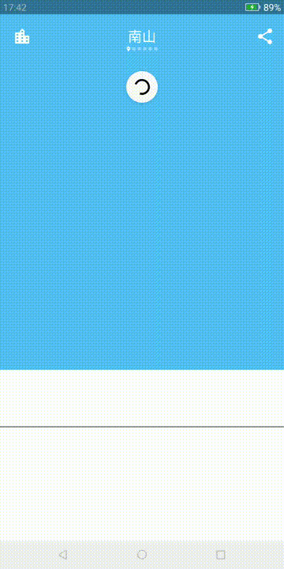

## <activity href="#chinese">中文</activity> | <activity href="#english">English</activity>

* [LightWeather APK](http://fir.im/lightweather)

-----

## 
About Mysplash

### Introduction

* A light weather android client.
* Powered by [heweather.com](http://heweather.com/)
* Auto location, 11 dynamic weather background.
* Material design.
* RxJava2 + MVVM + Retrofit + Room + Dagger2.

### Contact Me

* way.ping.li@gmail.com

-----

## 
关于Mysplash

### 简介

* 一款轻量化的第三方Unsplash客户端
* 数据来自[和风天气](http://heweather.com/)
* 自动定位当前城市，11 种动态天气效果
* 遵循material design设计
* RxJava2 + MVVM + Retrofit + Room + Dagger2

### 联系作者

* way.ping.li@gmail.com
